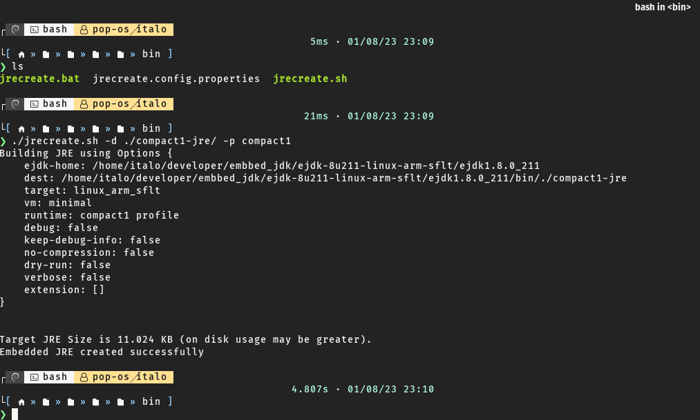
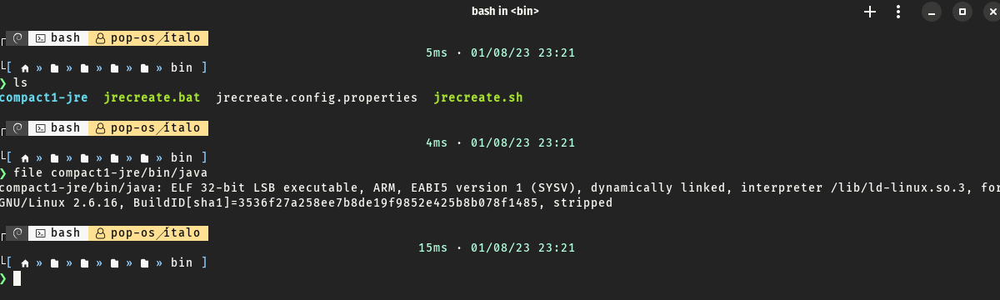
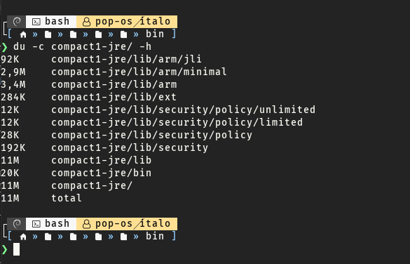

# Running Java on ARM Processor

Guide about how to compile an JVM and run Java 8 on any ARM processor with focus on Fibocom modules with ARMV7L (NL668) or any module with linux embedd

## 1. Requirements

* Java JRE 8 or newer
* Fibocom module NL668
* Oracle Java SE Embedded version 8 update 211 (8u211) (instructions on next step)

## 2. Java SE Embedded 8

Access the Java SE Embedded 8 page and download the target architecture version:

* Versions:
 <https://www.oracle.com/java/technologies/java-se-embedded-archive-downloads.html>

* Oracle Java SE Embedded version 8 update 211 <https://www.oracle.com/java/technologies/javaseembedded8u211-downloads.html>

* Select ARMv5/ARMv6/ARMv7 Linux - SoftFP ABI, Little Endian 2

## 3. Compiling JVM

Extract the EJDK files in any folder and open a terminal inside /ejdk1.8.0/bin/
then use the following command to create/compile the JVM:

```shell
./jrecreate.sh -d ./compact1-jre/ -p compact1
```

Compact Profiles for Subsets of the Java SE API
you can minimize space requirements on the embedded device by limiting the static footprint to Java API packages that the application uses. You can build a custom JRE that contains the full set of Java SE APIs or one of three subsets, called profiles.



### Compact1 Profile APIs

Similar to the legacy Connected Device Configuration (CDC) with the Foundation Profile, secure sockets layer (SSL), logging, and scripting language support, including Javascript. When configured with the minimal JVM, the compact1 profile APIs have a static footprint of about **12MB**.

### Compact2 Profile APIs

* Adds these packages to compact1:

* Remote Method Invocation (RMI, JSR 66)

* Java API for XML Processing (JAXP, JSR 280)

* Java Database Connectivity (JDBC, JSR 169)

When configured with the minimal JVM, the compact2 profile APIs have a static footprint of about **17MB.**

### Compact3 Profile APIs

The compact2 profile adds serviceability, naming, the compiler API, and more security.

For a description of serviceability, see <http://openjdk.java.net/groups/hotspot/docs/Serviceability.html>

Note that the compact3 profiles cannot be configured with the minimal JVM.

### Full JRE APIs

The full JRE adds desktop, web services and CORBA APIs. It also supports Java Flight Recorder (JFR) command line options.

The full JRE APIs include all the Java SE classes, yet space-saving optimizations make a full Oracle Java SE Embedded JRE substantially smaller than a Java SE JRE. When configured with the client JVM, the full JRE APIs have a static footprint of about **50MB**.

more info at: <https://docs.oracle.com/javase/8/embedded/develop-apps-platforms/compact-profiles.htm>

```shell
file compact1-jre/bin/java
```



And now let's take a look about the folder size:

```shell
du -c compact1-jre/ -h
```
